## Split Img
```py
h = img.shape[0] // 3 # 整除才可以index
b, g, r = img[0:h,:], img[h:2*h,:], img[2*h:,:]
```
|B|G|R|
|-|-|-|
|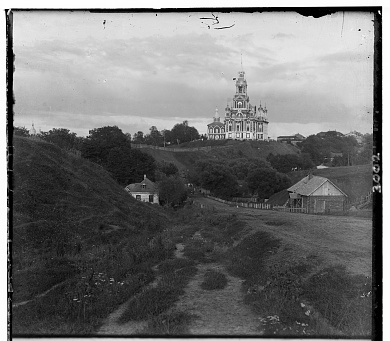|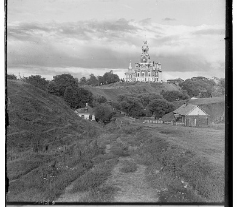|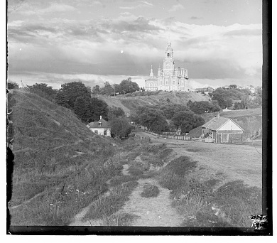|

## Exhaustive Align
[-15,15] 之間一個一個算分
```py
def l2_align(img1, img2): 
    best_score = -1
    best_shift = (0, 0)

    ref = crop_border(img1, 0.1)

    for dy in range(-15, 16):
        for dx in range(-15, 16):
            shifted = shift(img2, dy, dx)
            shifted_crop = crop_border(shifted, 0.1)
            score = l2(ref, shifted_crop)

            if score < best_score:
                best_score = score
                best_shift = (dy, dx)

    return best_shift
```

## L2
Euclidean Distance: $\sqrt{(\Delta{x})^2+(\Delta{y})^2}$
```py
for i in range(h):
    for j in rane(w):
        diff = img1[i][j] - img2[i][j]
        sum += diff * diff
```

## NCC
相關係數: $$r=\frac{S_{xy}}{S_{xx}\times S_{yy}}$$
NCC:
$$ \frac{\sum{(i_1-\mu_1)(i_2-\mu_2)}}{\sqrt{(\sum{{i_1-\mu_1}^2})(\sum{{i_2-\mu_2}^2})}} $$

```py
def ncc(img1, img2):
    mean1 = np.mean(img1)
    mean2 = np.mean(img2)

    img1_m = img1 - mean1
    img2_m = img2 - mean2

    b = np.sum(img1_m * img2_m)
    a = np.sqrt(np.sum(img1_m ** 2) * np.sum(img2_m ** 2))

    if a == 0:
        return -1

    return b / a
```

### Pyramid Align
壓縮圖片，找到大致位移再放大找最佳位移
```py
def pyramid_align(img1, img2, level):
    if level == 0:
        best_score = -1
        best_shift = (0, 0)

        ref = crop_border(img1, 0.1)

        for dy in range(-15, 16):
            for dx in range(-15, 16):
                shifted = shift(img2, dy, dx)
                shifted_crop = crop_border(shifted, 0.1)
                score = ncc(ref, shifted_crop)

                if score > best_score:
                    best_score = score
                    best_shift = (dy, dx)

        return best_shift

    # 縮小圖片
    small_img1 = cv2.resize(img1, (img1.shape[1] // 2, img1.shape[0] // 2))
    small_img2 = cv2.resize(img2, (img2.shape[1] // 2, img2.shape[0] // 2))

    small_shift = pyramid_align(small_img1, small_img2, level - 1)

    base_dy = small_shift[0] * 2
    base_dx = small_shift[1] * 2

    best_score = -1
    best_shift = (base_dy, base_dx)

    ref = crop_border(img1, 0.1)

    for dy in range(base_dy - 2, base_dy + 3):
        for dx in range(base_dx - 2, base_dx + 3):
            shifted = shift(img2, dy, dx)
            shifted_crop = crop_border(shifted, 0.1)
            score = ncc(ref, shifted_crop)

            if score > best_score:
                best_score = score
                best_shift = (dy, dx)

    return best_shift
```

## 三種
|ex+L2|ex+NCC|Pyramid2+NCC|Pyramid4+NCC|
|-|-|-|-|
|find min，找差異最小|find max，找相似度最高|||
|G -> B shift: (1, -1)<br/>R -> B shift: (7, -1)<br/>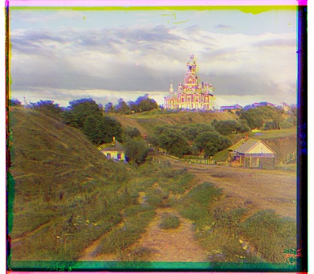 |G -> B shift: (1, -1)<br/>R -> B shift: (7, -1)<br/>|G -> B shift: (5, 2)<br/>R -> B shift: (12, 3)<br/>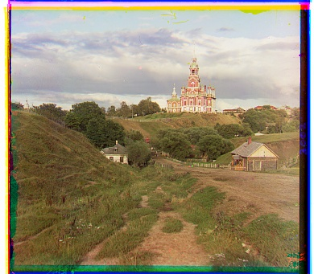|G -> B shift: (5, 2)<br/>R -> B shift: (12, 3)<br/>|
|G -> B shift: (-6, 0)<br/>R -> B shift: (9, 1)<br/>|G -> B shift: (-6, 0)<br/>R -> B shift: (9, 1)<br/>|G -> B shift: (-3, 2)<br/>R -> B shift: (3, 2)<br/>|G -> B shift: (-3, 2)<br/>R -> B shift: (3, 2)<br/>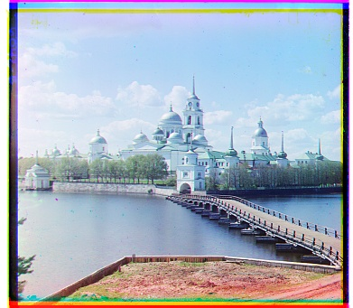|
|G -> B shift: (3, 2)<br/>R -> B shift: (6, 3)<br/>|G -> B shift: (3, 2)<br/>R -> B shift: (6, 3)<br/>|G -> B shift: (3, 3)<br/>R -> B shift: (6, 3)<br/>|G -> B shift: (3, 3)<br/>R -> B shift: (6, 3)<br/>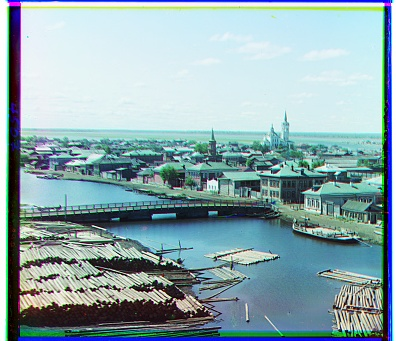|

## 不同pyramid次數的結果
|Img|Pyramid1|Pyramid2|Pyramid3|Pyramid4|
|-|-|-|-|-|
|church|G -> B shift: (25, 4)<br/>R -> B shift: (32, -5)<br/>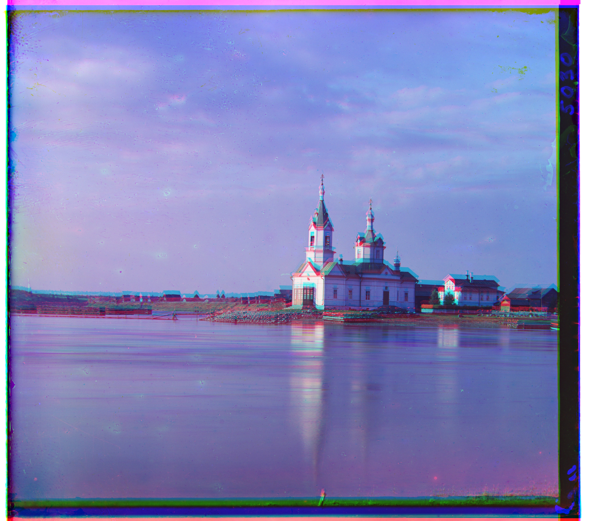|G -> B shift: (25, 4)<br/>R -> B shift: (58, -4)<br/>|G -> B shift: (25, 4)<br/>R -> B shift: (58, -4)<br/>|G -> B shift: (25, 4)<br/>R -> B shift: (58, -4)<br/>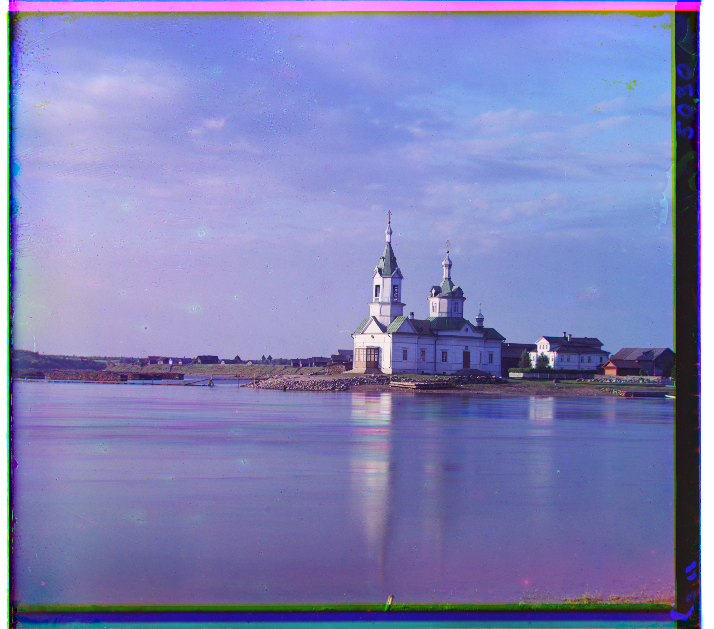|
|emir|G -> B shift: (32, 20)<br/>R -> B shift: (32, 32)<br/>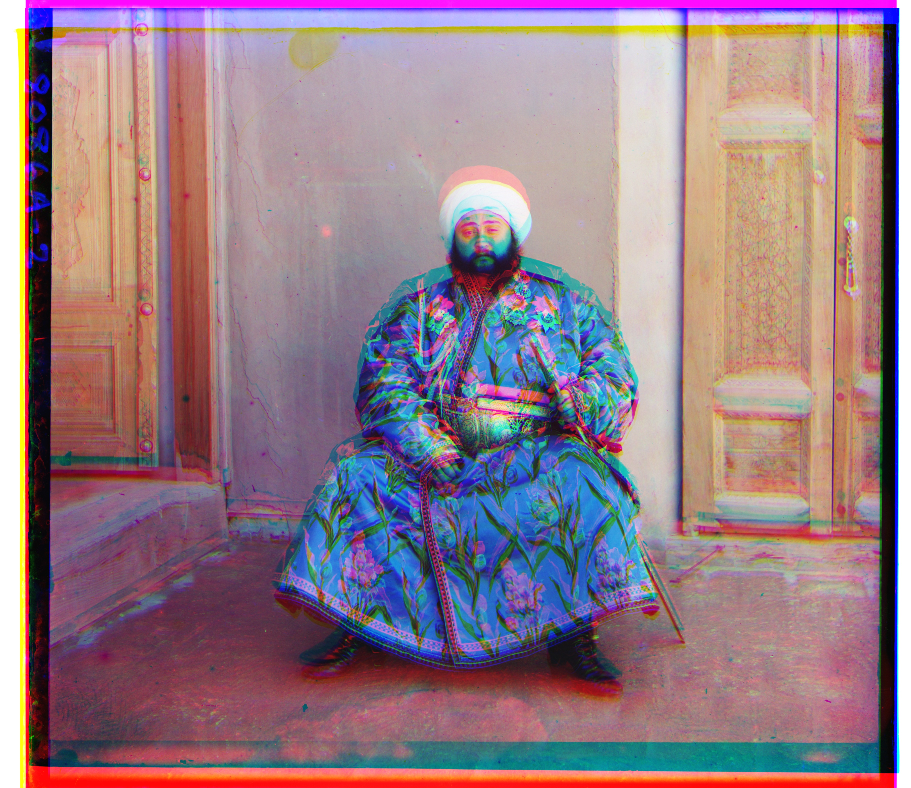|G -> B shift: (49, 24)<br/>R -> B shift: (66, 42)<br/>|G -> B shift: (49, 24)<br/>R -> B shift: (104, 56)<br/>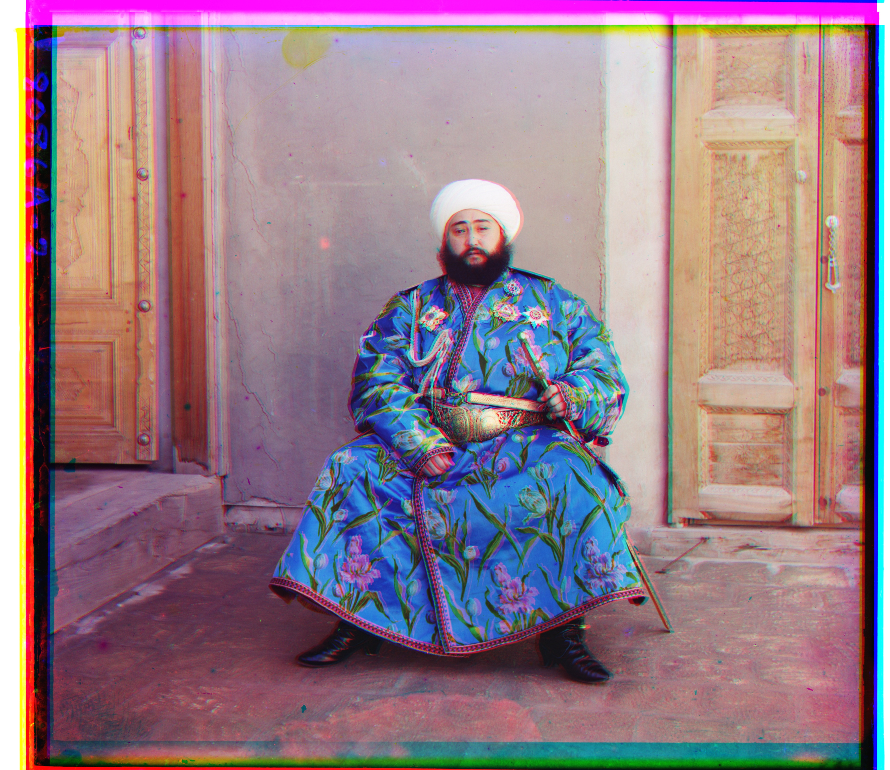|G -> B shift: (49, 24)<br/>R -> B shift: (141, -205)<br/>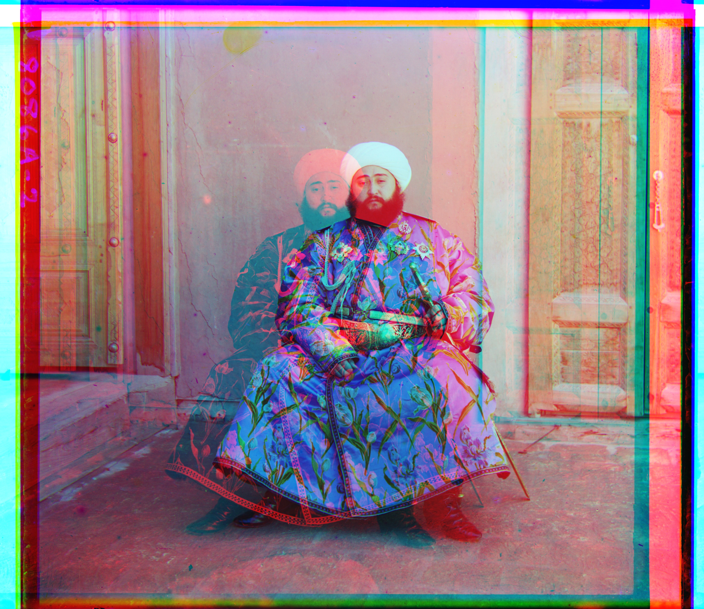|
|melon|G -> B shift: (32, 8)<br/>R -> B shift: (32, 16)<br/>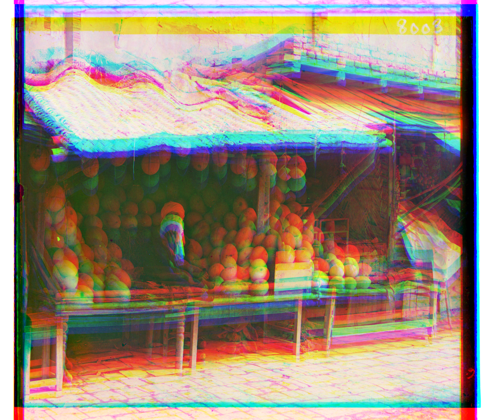|G -> B shift: (66, 6)<br/>R -> B shift: (66, 16)<br/>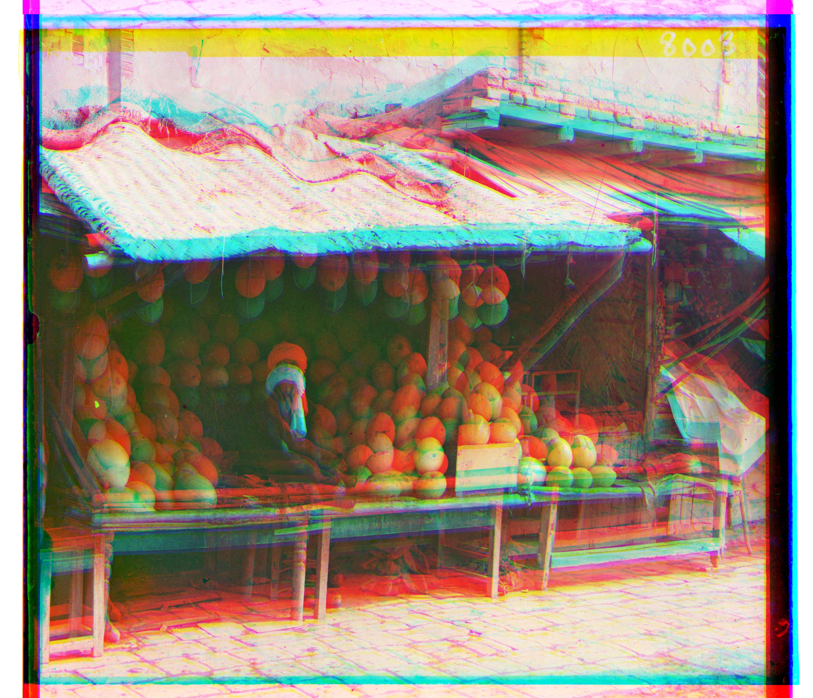|G -> B shift: (82, 11)<br/>R -> B shift: (134, 13)<br/>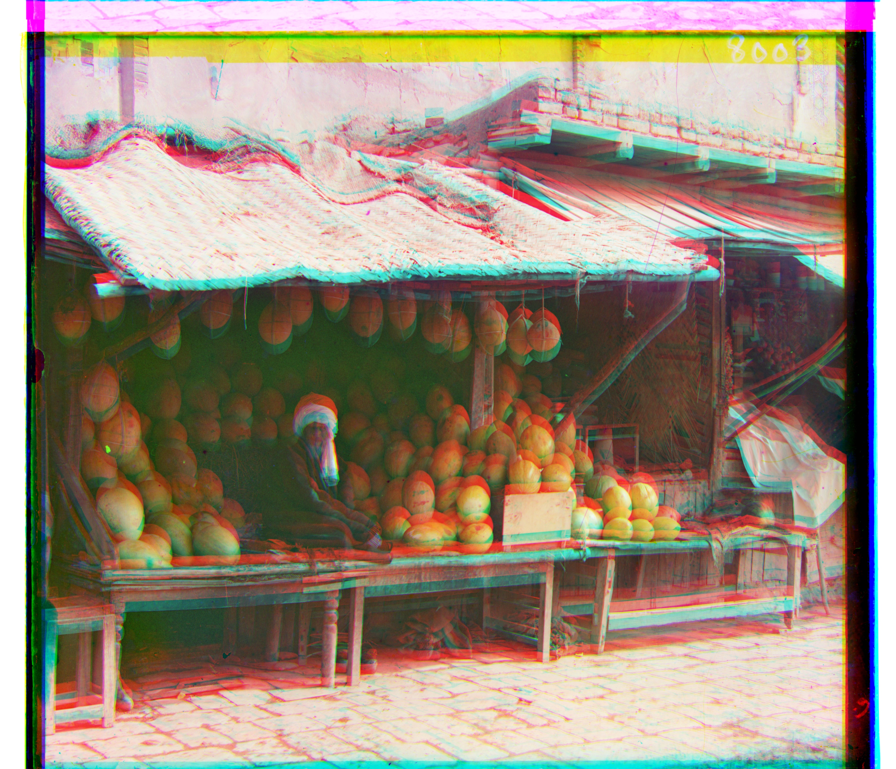|G -> B shift: (82, 11)<br/>R -> B shift: (178, 13)<br/>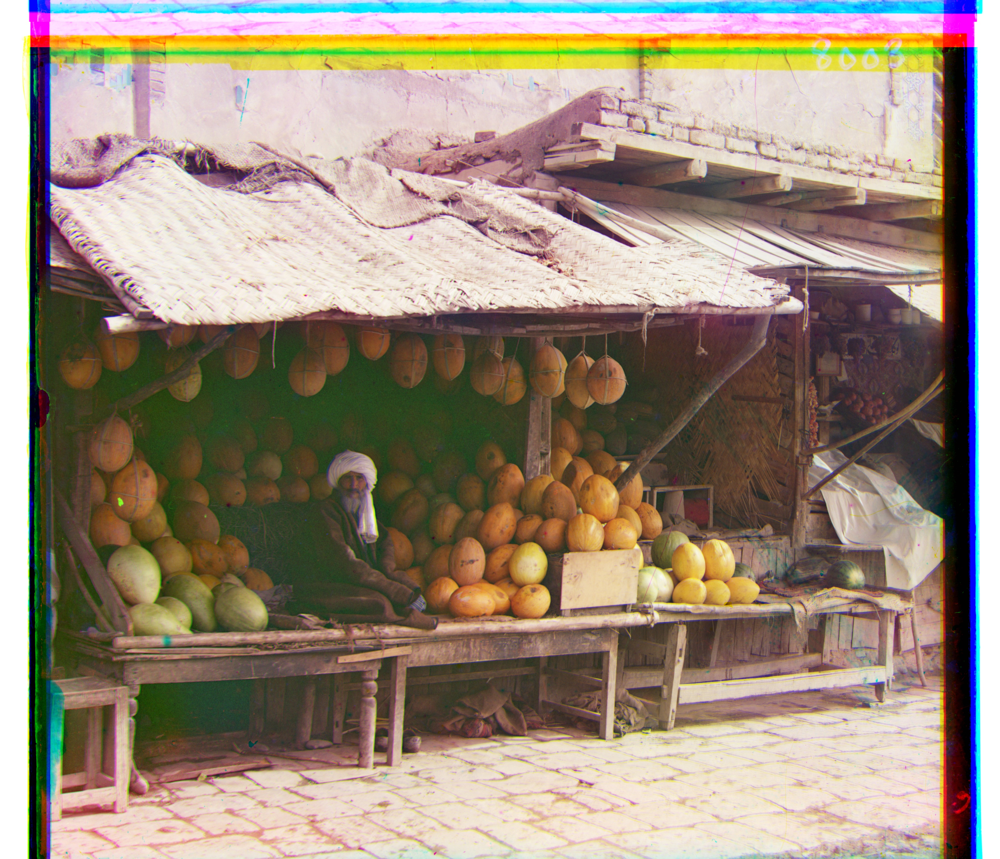|

Q:
- crop
- pyramid level
