# Part 1 Filter
## 1.1
$$G = \sqrt{{d_x}^2+{d_y}^2}$$
```py
def part1_1(img_path='cameraman.png'):
    img = load(img_path)

    dx = np.array([[1, -1]])
    dy = np.array([[1], [-1]])

    gx = convolve2d(img, dx, mode='same', boundary='symm')
    gy = convolve2d(img, dy, mode='same', boundary='symm')
    g_mag = np.sqrt(gx**2 + gy**2)

    threshold = 0.1
    edge_img = (g_mag > threshold).astype(float)
```

**Original Image**
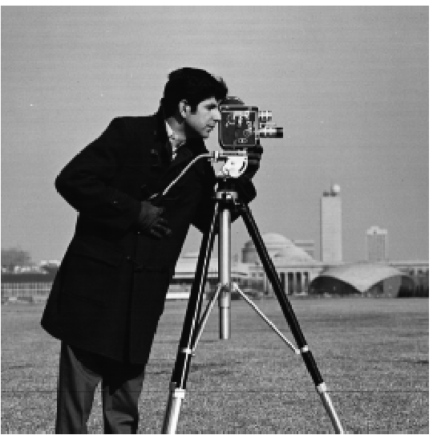

|Threshold|Image|
|-|-|
|0.1|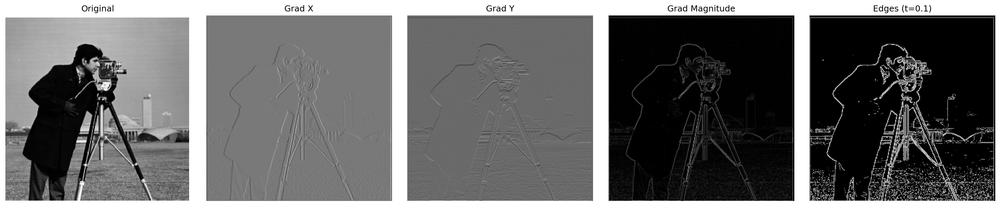|
|0.15||
|0.2|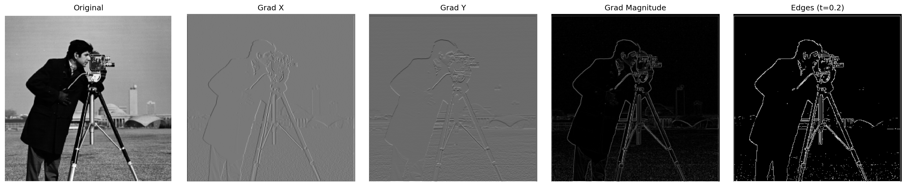|
|0.25|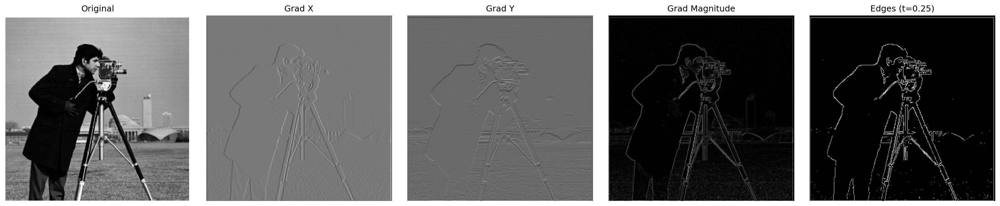|
|0.3|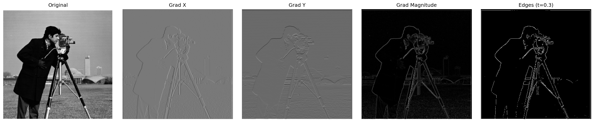|

## 1.2
### Gaussian Blur
先模糊再找 gradient
$$img \rightarrow G \rightarrow D$$
pros: 降低雜訊
cons: edge 可能變模糊
```py
def part1_2(img+path='cameraman.png'):
    img = load_gray(img_path)

    D_x = np.array([[1, -1]])
    D_y = np.array([[1], [-1]])
    G = make_gaussian_kernel(ksize=15, sigma=2) 

    blurred = convolve2d(img, G, mode='same', boundary='symm')
    gx1 = convolve2d(blurred, D_x, mode='same', boundary='symm')
    gy1 = convolve2d(blurred, D_y, mode='same', boundary='symm')
    mag1 = np.sqrt(gx1**2 + gy1**2)
    edge1 = (mag1 > 0.05).astype(float) 
```

### DoG
把 Gaussian 跟 filter 合成，再 convolution 
pro: faster，因為只要對原圖 convolution 一次就好
$$img\rightarrow (G \times D)$$
```py
    DoG_x = convolve2d(G, D_x, mode='same', boundary='symm')
    DoG_y = convolve2d(G, D_y, mode='same', boundary='symm')
    gx2 = convolve2d(img, DoG_x, mode='same', boundary='symm')
    gy2 = convolve2d(img, DoG_y, mode='same', boundary='symm')
    mag2 = np.sqrt(gx2**2 + gy2**2)
    edge2 = (mag2 > 0.05).astype(float)
```

|Threshold|Image|
|-|-|
|0.025|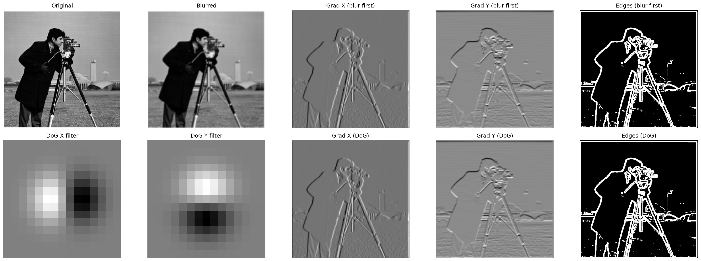|
|0.05|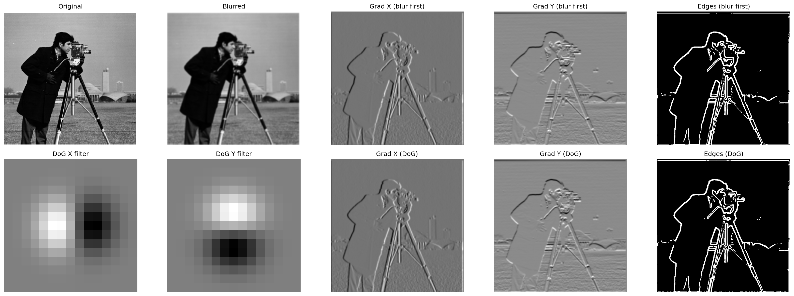|
|0.075|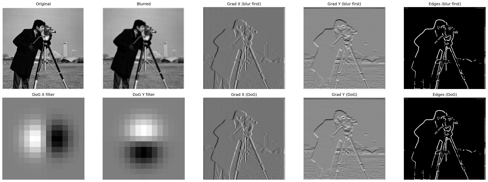|
|0.1||

# Part 2
## 2.1
### Sharpen
先blur，再resharpen
$$sharpen = img + \alpha(img-blurred)$$
$\alpha$ 可以決定sharpen的強度

```py
def sharpen(img, ksize=15, sigma=3, alpha=1.5):
    G = make_gaussian_kernel(ksize, sigma)
    if img.ndim == 3:
        blurred = np.stack([convolve2d(img[:,:,c], G, mode='same', boundary='symm') for c in range(3)], axis=2)
    else:
        blurred = convolve2d(img, G, mode='same', boundary='symm')
    return np.clip(img + alpha * (img - blurred), 0, 1)
```

|alpha|image|
|-|-|
|1.5|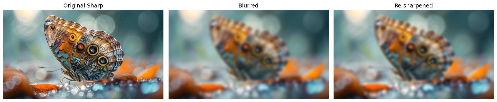|
|3|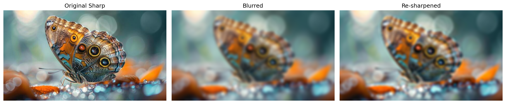|
|10|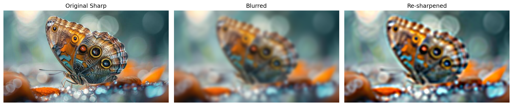|

## 2.2


